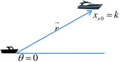
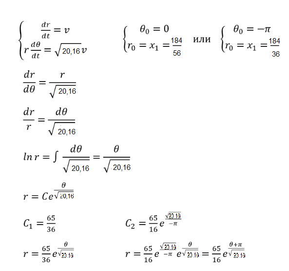
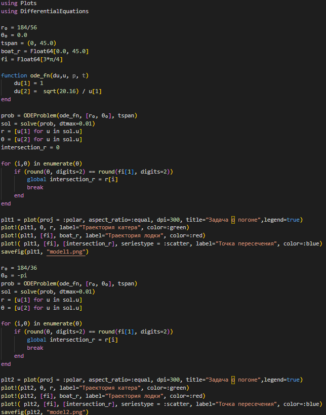
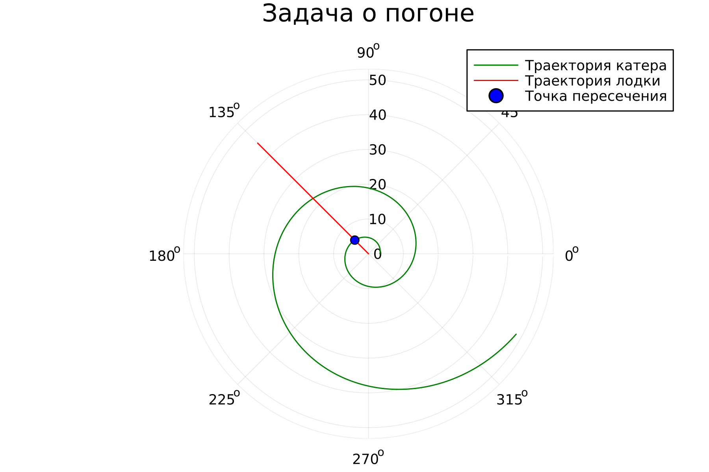
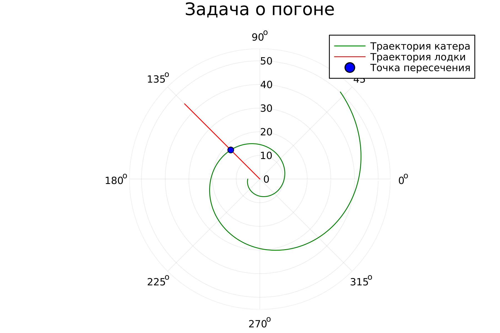

---
## Front matter
title: "Лабораторная работа № 2"
subtitle: "Задача о погоне"
author: "Покрас Илья Михайлович"

## Generic otions
lang: ru-RU
toc-title: "Содержание"

## Bibliography
bibliography: bib/cite.bib
csl: pandoc/csl/gost-r-7-0-5-2008-numeric.csl

## Pdf output format
toc: true # Table of contents
toc-depth: 2
lof: true # List of figures
lot: false
fontsize: 12pt
linestretch: 1.5
papersize: a4
documentclass: scrreprt
## I18n polyglossia
polyglossia-lang:
  name: russian
  options:
	- spelling=modern
	- babelshorthands=true
polyglossia-otherlangs:
  name: english
## I18n babel
babel-lang: russian
babel-otherlangs: english
## Fonts
mainfont: PT Serif
romanfont: PT Serif
sansfont: PT Sans
monofont: PT Mono
mainfontoptions: Ligatures=TeX
romanfontoptions: Ligatures=TeX
sansfontoptions: Ligatures=TeX,Scale=MatchLowercase
monofontoptions: Scale=MatchLowercase,Scale=0.9
## Biblatex
biblatex: true
biblio-style: "gost-numeric"
biblatexoptions:
  - parentracker=true
  - backend=biber
  - hyperref=auto
  - language=auto
  - autolang=other*
  - citestyle=gost-numeric
## Pandoc-crossref LaTeX customization
figureTitle: "Рис."
tableTitle: "Таблица"
listingTitle: "Листинг"
lofTitle: "Список иллюстраций"
lotTitle: "Список таблиц"
lolTitle: "Листинги"
## Misc options
indent: true
header-includes:
  - \usepackage{indentfirst}
  - \usepackage{float} # keep figures where there are in the text
  - \floatplacement{figure}{H} # keep figures where there are in the text
---

# Цели работы

Создать алгоритм построения математической модели на примере задачи о погоне. Провести теоретические рассуждение и вывести дифференциальные уравнения для определения точки пересечения лодки и катера из задачи.

# Задание

- Изучить условия задачи;
- Вывести дифференциальное уравнение, соответствующее условиям задачи;
- Написать программу для расчета и построения модели траетории движения катера и лодки.
- Определить точку пересечения катера и лодки.

# Теоретическое введение

Julia -  высокоуровневый высокопроизводительный свободный язык программирования с динамической типизацией, созданный для математических вычислений.

Кривая погони — кривая, представляющая собой решение задачи о «погоне», которая ставится следующим образом. Пусть точка {\displaystyle A}A равномерно движется по некоторой заданной кривой. Требуется найти траекторию равномерного движения точки {\displaystyle P}P такую, что касательная, проведённая к траектории в любой момент движения, проходила бы через соответствующее этому моменту положение точки {\displaystyle A A.

# Выполнение лабораторной работы

Постановка задачи

1. Принимаем за $t_0 = 0, x_{л0}=0$  - место нахождения лодки браконьеров в момент обнаружения, $x_{к0}=k$ - место нахождения катера береговой охраны относительно лодки браконьеров в момент обнаружения лодки.

2. Введем полярные координаты. Считаем, что полюс - это точка обнаружения лодки браконьеров $x_{л0}$ $(\theta=x_{л0}=0)$, а полярная ось r проходит через точку нахождения катера береговой охраны (рис. @fig:001).

{#fig:001}

3. Траектория катера должна быть такой, чтобы и катер, и лодка все время были на одном расстоянии от полюса $\theta$, только в этом случае траектория катера пересечется с траекторией лодки.
Поэтому для начала катер береговой охраны должен двигаться некоторое
время прямолинейно, пока не окажется на том же расстоянии от полюса, что
и лодка браконьеров. После этого катер береговой охраны должен двигаться
вокруг полюса удаляясь от него с той же скоростью, что и лодка
браконьеров.
4. Чтобы найти расстояние x (расстояние после которого катер начнет двигаться вокруг полюса), необходимо составить простое уравнение. Пусть через время t катер и лодка окажутся на одном расстоянии x от полюса. За это время лодка пройдет x, а катер k-x (или k+x, в зависимости от начального положения катера относительно полюса). Время, за которое они пройдут это расстояние, вычисляется как x/v или k-x/4.6v (во втором случае x+k/4.6v). Так как время одно и то же, то эти величины одинаковы. Тогда неизвестное расстояние x можно найти из следующего уравнения:

    $\frac{x}{v}=\frac{k-x}{4.6v}$ в первом случае или

    $\frac{x}{v}=\frac{x+k}{4.6v}$ во втором.

    Отсюда мы найдем два значения $x_1=\frac{184}{46}$ и $x_2=\frac{184}{26}$ задачу будем решать для двух случаев.
5. После того, как катер береговой охраны окажется на одном расстоянии от полюса, что и лодка, он должен сменить прямолинейную траекторию и начать двигаться вокруг полюса удаляясь от него со скоростью лодки v. Для этого скорость катера раскладываем на радиальную и тангенциальную скоростиТогда получаем $v_\tau=\sqrt{(4.6v)^2-v^2}=\sqrt{20.16}v^2$.

6. Решение исходной задачи сводится к решению системы из двух дифференциальных уравнений.(image/3.png)

{#fig:003}

7. Напишем программу для построения траектори движения катера береговой охраны и лодки с помощью Julia.(рис. @fig:004).

{#fig:004}

{#fig:005}

{#fig:006}

# Вывод

Мы научились создавать алгоритмы построения математической модели на примере задачи о погоне.

# Список литературы

[1] https://julialang.org/

[2] https://yamadharma.github.io/ru/post/2021/01/02/julia-differentialequations-callback-functions/

[3] https://docs.juliahub.com/DifferentialEquations/UQdwS/6.15.0/tutorials/ode_example/

[4] https://docs.juliaplots.org/stable/